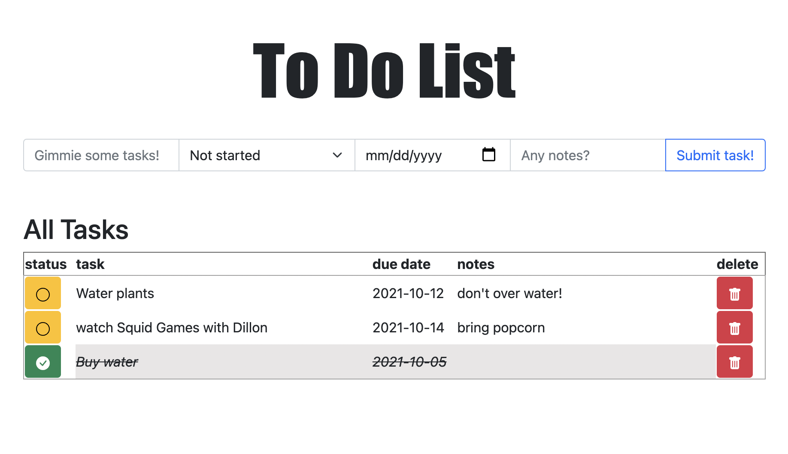

# Project Name
Paran's To-Do List

## Description

This is a to-do list I was able to accomplish between lunch breaks and evenings after my full time work. What a ride! 

## Prerequisites

- Homebrew
- Node.js
- PostgreSQL

## Installation

Here is how I got my application set up and running! 

PHASE ZERO

I spent some time reviewing past projects, mapping out what I would be (realistically) be able to accomplish with my short free time for homework each evening. I set up a task list for maximum efficiency and got to work!

PHASE ONE: Basic Setup

- git init
- npm init --y
- npm install express pg, update start scripts "start": "node server/server.js"
- spin up server
- serve index.html/scripts/styles/vendors within a public file within the server file
- source scripts in html
- test the "handshake" between all linked files / test server

PHASE TWO
- create a db/table: 
    CREATE TABLE paran_todo_list (
    id SERIAL PRIMARY KEY,
    task VARCHAR NOT NULL,
    notes VARCHAR NOT NULL,
    due VARCHAR NOT NULL,
    stat BOOLEAN NOT NULL
    );
- create pool module
- require in server.js 
- make GET route w/ SELECT * FROM tableName 
- test in browser 
- GET call on page load

PHASE THREE:
- interface for displaying messages
- interface for adding a message
- capture user input & send to server via POST
- input new message into db in POST route 

PHASE FOUR:
- create a delete feature that targets elements by their id, goes to the server via DELETE and deletes information from the db
- implement a button feature within the appended code to visually represent the delete button with an icon (used bootstrap here)
- create an update feature that goes to the server via PUT and updates the db information
- implement a button toggle feature that will "check" or "un-check" tasks displayed on the DOM
- zhuzh up the CSS file with bootstrap code 

## Usage
User is able to add tasks with a due-date, complete or incomplete status, and note functions. Tasks will be sorted by their completion status. Once a task has been completed, the user interface will change the color and look of the task to indicate completion.  

## Built With
- Express and PG
- JQuery and SQL
- Javascript
- HTML 
- CSS

## Acknowledgement
A huge shoutout and thank you to Prime Digital Academy, my instructor Dev Jana, and Emily for giving me the tools and the confidence to dive into the creation of this app, knowing I am supported every step of the way. Special thanks to Dillon, Hannah, and my Thursday study group for meeting me where I am at and nudging me in the right direction. 

## Support
If you have suggestions or issues, please email me at parankashani@gmail.com